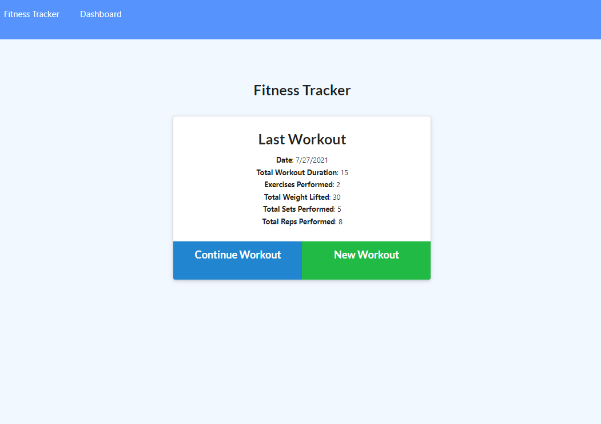

# Fitness Tracker

## Table of Contents
[Title](#title)

[Description](#description)

[Installation](#installation)

[Usage](#usage)

[Test](#test)

[License](#license)

## Description
This project was built using mongodb, mongoose, express, and node.js. This application allows a user to create new workouts, add exercises to their workout, mark their workout as complete, and are given a graph representation of their physical activity.
## Installation
clone this repo, run npm i to install the required dependencies, and then run node server.js to spin up the application on localhost 3000. *Important Note, remember to have a mongod connection firing in order to connect to the database.
# Usage
If you click add new exercise, fill out the following prompts. Return to the homepage and you will see the data represented in the most recent workout section on the homepage. 
## Test
node server.js
## Questions
if you have any additional questions, please contact me using the following links below:

Github: [https://github.com/JaredC71](https://github.com/JaredC71)
 
Email Adress: jaredcolletti123@gmail.com 
## License 